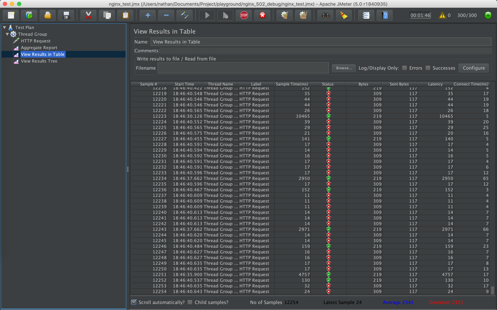
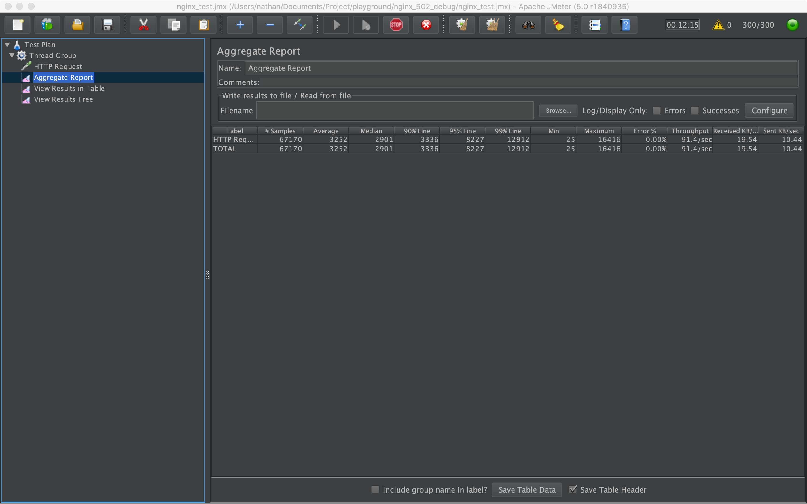

# nginx_502_debug

本地复现 nginx 502 错误 demo，排查解决 nginx 问题。

详细分析过程参考博客： [详解压测中出现的 nginx 502 no live upstreams 错误](https://xnathan.com/2019/05/07/nginx-502/)

## 运行

1. 会出 502 错误版本

```bash
$ docker-compose up
```

用 jmeter 打开 `nginx_test.jmx` 进行测试，一段时间后出现错误：




2. 稳定无 502 错误版本

```bash
$ docker-compose -f docker-compose.stable.yml up
```

长时间运行无错误：


